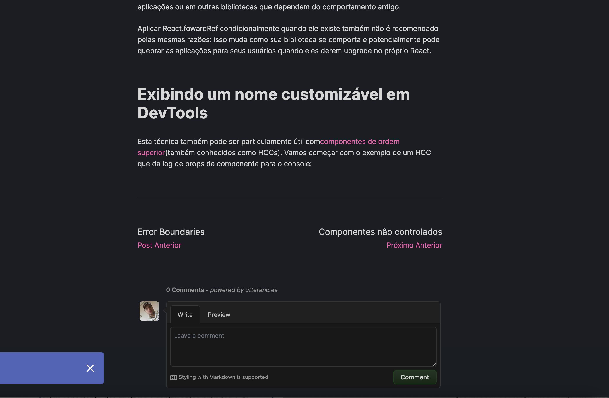

#Desafio Ignite Q3 2021 - Adicionando features ao Blog



## features add

- preview prismic
- integrate with utteranc.es  comment/issue github
- post navigation
- last publication post

## Setup

git clone git clone https://github.com/vagnerolliver/ignite-challenge-07-adicionando-features-ao-blog


Instal dependencies

```bash
$ yarn

or

$ npm install
```

## Run


```bash
$ yarn or npm dev
````

Browser

http://localhost:3001

## Tests
$ yarn or npm test
